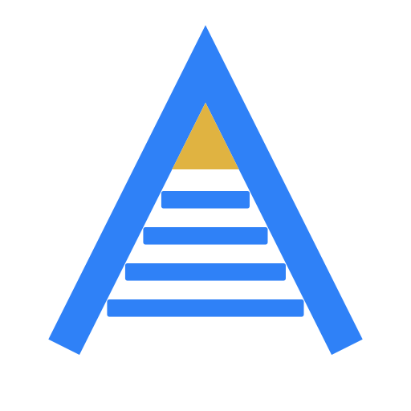
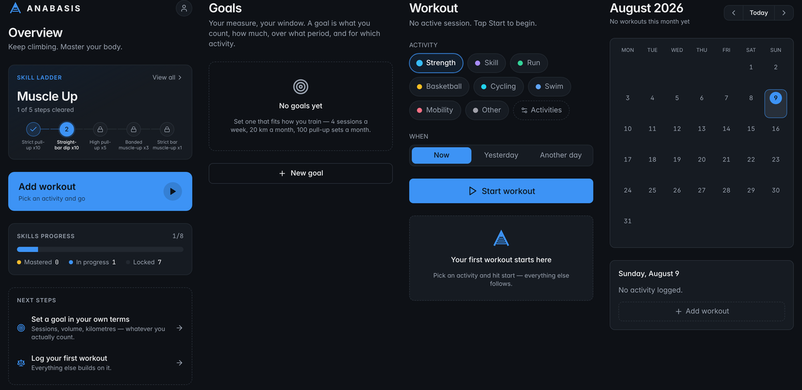

<div align="center">



# Anabasis · Ἀνάβασις

**Weighted-calisthenics & skill-progression tracker.**
Offline-first PWA · TypeScript strict · bilingual (EN/EL)

[](https://github.com/Frezzaroukos/anabasis/actions/workflows/ci.yml)


**[▶ Live demo](https://frezzaroukos.github.io/anabasis/)** · no signup, no backend, data stays on your device



</div>

---

> *Anabasis* — «η ανάβαση». Κάθε skill είναι μια σκάλα: tuck → advanced tuck →
> straddle → full. Η εφαρμογή υπάρχει για να δείχνει σε ποιο σκαλί είσαι και
> ποιο είναι το επόμενο.

## Why it exists

Generic gym apps treat **skills** as an afterthought. If you train front lever,
planche or muscle-up you are not logging "sets × reps" — you are moving through
a **chain of prerequisites**, measured in hold-times and technical milestones.

Anabasis is built for athletes doing **both**: weighted basics (pull-ups, dips,
pistol squats) **and** skill progressions.

## What it does

| | |
|---|---|
| **Skill ladders** | 8 skills, 4–6 steps each. Locked steps stay **visible** — you see the road, not just your rung. The active ladder leads the home screen. |
| **Workout logger** | Live set logging, separate bodyweight + added weight, session & rest timers, RPE/RIR/tempo, warm-up and failure flags, quick-log parsing (`80 5,4,3,2`). |
| **Goals in your own terms** | A goal is four independent axes — *what you count × how much × over what window × for which activity or exercise*. "4 sessions a week", "20 km a month" and "100 pull-up sets a month" are the same feature, not three. Calendar or rolling windows. |
| **PR tracking** | 8 PR types across strength and non-set activities (distance, duration, pace). Warm-ups excluded. e1RM via Epley/Brzycki. |
| **Your data** | Full JSON export/import. No account, no server, nothing locked in. |
| **Customisable home** | Hide and reorder every card. A hidden card never mounts and never queries. |

## Engineering notes

The parts worth reading, and why they are the way they are.

**Local-first, and honest about it.** Everything lives in IndexedDB (Dexie).
There is no backend, so there is no "syncing…" lie — but every write stamps
`updated_at` and deletes are soft (`deleted_at`), so a future sync has what it
needs.

**Schema migrations, v1 → v9.** Each version ships its own `.upgrade()` with
backfills; all additive, no data loss. v9 is the interesting one: existing
goals are backfilled to *rolling* windows because that is how they were already
counting — migrating them to *calendar* would have silently changed the meaning
of a goal the user had already set.

**Components never touch `db.*`.** All access goes through `lib/db/queries.ts`
and `lib/db/goals.ts`. `lib/domain/` is pure functions (e1rm, pr, volume) with
no DB or UI dependency, which is why they are the easiest things to test.

**No invented data.** Cards return `null` rather than render zeros; a stat with
no measurement behind it is misleading, not neutral. No default goals are
seeded — a goal the user did not set is not a goal.

**Testing where it pays.** 154 tests concentrated on migrations, the goal
window calculator (pure, with an injectable clock, so "the week starts on
Monday" does not depend on the day CI runs), PR detection, and the card-order
resolver — each of its cases matching a change that will actually happen
(a card added, a card removed, corrupted preferences).

```
src/
├── app/          routes + AppShell (bottom tab nav)
├── features/     one folder per surface; dashboard cards are independent
│                 components that query for themselves
├── components/   shared primitives (Logo, Card, ProgressRing, ActivityChip)
├── lib/
│   ├── db/       Dexie schema, migrations, typed queries, seeds
│   └── domain/   pure logic: e1rm · pr · volume  ← unit-tested
└── i18n/         en.json · el.json
```

## Stack

Vite 5 · React 18 · **TypeScript (strict)** · Tailwind 3 · **Dexie 4** (IndexedDB) ·
React Router 6 · Recharts · vite-plugin-pwa + Workbox · i18next · Vitest

## Run it

```bash
npm install
npm run dev      # http://localhost:5173
npm test         # 154 tests
npm run build    # production + service worker
```

Screenshots in this README are generated, not hand-taken:

```bash
node scripts/shots.mjs        # headless Chromium, 390×844
node scripts/gen-brand-assets.mjs   # favicon/PWA/OG from one source of truth
```

## Status

Working: skill ladders, workout logger, goals, PR tracking, calendar, body
metrics, programs, progress charts, export/import, i18n, PWA, multiple local
profiles.

Not built: accounts and cross-device sync (would unlock friends and
leaderboards), native app.

---

Built by [Aggelos Frezzaroukos](https://github.com/Frezzaroukos) · MIT
